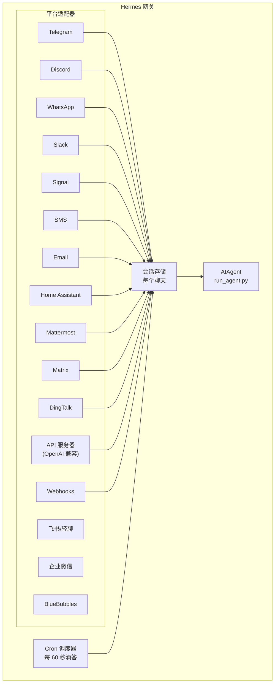

# 消息网关

从 Telegram、Discord、Slack、WhatsApp、Signal、SMS、Email、Home Assistant、Mattermost、Matrix、DingTalk、Webhooks 或任何 OpenAI 兼容前端通过 API 服务器与 Hermes 聊天 - 架构和设置概述。

## 平台比较

| 平台 | 语音 | 图片 | 文件 | 线程 | 回复 | 打字 | 流式 |
|------|------|------|------|------|------|------|------|
| Telegram | ✅ | ✅ | ✅ | ✅ | — | ✅ | ✅ |
| Discord | ✅ | ✅ | ✅ | ✅ | ✅ | ✅ | ✅ |
| Slack | ✅ | ✅ | ✅ | ✅ | ✅ | ✅ | ✅ |
| WhatsApp | — | ✅ | ✅ | — | — | ✅ | ✅ |
| Signal | — | ✅ | ✅ | — | — | ✅ | ✅ |
| SMS | — | — | — | — | — | — | — |
| Email | — | ✅ | ✅ | ✅ | — | — | — |
| Home Assistant | — | — | — | — | — | — | — |
| Mattermost | ✅ | ✅ | ✅ | ✅ | — | ✅ | ✅ |
| Matrix | ✅ | ✅ | ✅ | ✅ | — | ✅ | ✅ |
| DingTalk | — | — | — | — | — | ✅ | ✅ |
| 飞书/轻聊 | ✅ | ✅ | ✅ | ✅ | ✅ | ✅ | ✅ |
| 企业微信 | ✅ | ✅ | ✅ | — | — | ✅ | ✅ |
| BlueBubbles | — | ✅ | ✅ | — | ✅ | ✅ | — |

**语音** = TTS 音频回复和/或语音消息转录。**图片** = 发送/接收图片。**文件** = 发送/接收文件附件。**线程** = 线程化对话。**回复** = 消息上的表情符号回复。**打字** = 处理时的打字指示器。**流式** = 通过编辑进行渐进式消息更新。

## 架构



每个平台适配器接收消息，通过每个聊天的会话存储路由，并将其分派给 AIAgent 进行处理。网关还运行 cron 调度器，每 60 秒滴答一次以执行任何到期的任务。

## 快速设置

配置消息平台的最简单方法是交互式向导：

```bash
hermes gateway setup        # 所有消息平台的交互式设置
```

这将引导您通过箭头键选择配置每个平台，显示哪些平台已配置，并在完成后提供启动/重启网关。

## 网关命令

```bash
hermes gateway              # 在前台运行
hermes gateway setup        # 交互式配置消息平台
hermes gateway install      # 安装为用户服务（Linux）/launchd 服务（macOS）
sudo hermes gateway install --system   # 仅限 Linux：安装启动时系统服务
hermes gateway start        # 启动默认服务
hermes gateway stop         # 停止默认服务
hermes gateway status       # 检查默认服务状态
hermes gateway status --system         # 仅限 Linux：显式检查系统服务
```

## 聊天命令（消息内）

| 命令 | 描述 |
|------|------|
| `/new` 或 `/reset` | 开始新对话 |
| `/model [provider:model]` | 显示或更改模型（支持 `provider:model` 语法） |
| `/provider` | 显示可用提供商及其认证状态 |
| `/personality [name]` | 设置人格 |
| `/retry` | 重试最后一条消息 |
| `/undo` | 删除最后的交换 |
| `/status` | 显示会话信息 |
| `/stop` | 停止运行的代理 |
| `/approve` | 批准待处理的危险命令 |
| `/deny` | 拒绝待处理的危险命令 |
| `/sethome` | 将此聊天设置为主频道 |
| `/compress` | 手动压缩对话上下文 |
| `/title [name]` | 设置或显示会话标题 |
| `/resume [name]` | 恢复之前命名的会话 |
| `/usage` | 显示此会话的 token 使用情况 |
| `/insights [days]` | 显示使用见解和分析 |
| `/reasoning [level\|show\|hide]` | 更改推理努力或切换推理显示 |
| `/voice [on\|off\|tts\|join\|leave\|status]` | 控制消息语音回复和 Discord 语音频道行为 |
| `/rollback [number]` | 列出或恢复文件系统检查点 |
| `/background <prompt>` | 在单独的后台会话中运行提示 |
| `/reload-mcp` | 从配置重新加载 MCP 服务器 |
| `/update` | 将 Hermes Agent 更新到最新版本 |
| `/help` | 显示可用命令 |
| `/<skill-name>` | 调用任何已安装的技能 |

## 会话管理

### 会话持久化

会话在消息之间持久化，直到它们重置。代理记住您的对话上下文。

### 重置策略

会话根据可配置的策略重置：

| 策略 | 默认值 | 描述 |
|------|--------|------|
| 每日 | 4:00 AM | 在每天的特定小时重置 |
| 空闲 | 1440 分钟 | 在 N 分钟不活动后重置 |
| 两者 | (组合) | 首先触发的任何一个 |

在 `~/.hermes/gateway.json` 中配置每平台覆盖：